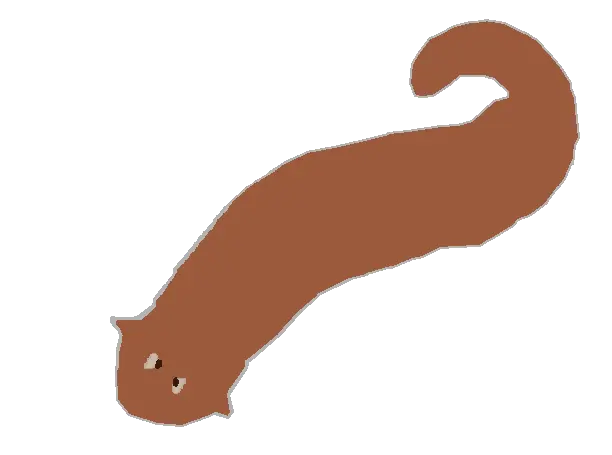

<div align="center">
  

  # Flatworm

  [Documentation] | [Contributing]
</div>

---

**Flatworm** is a register oriented bytecode language inspired by real world instruction set architecture's like x86, arm and riscv

This repository contains an assembler, runtime and documentation (documentation can be limited)

[Documentation]: docs/table_of_contents.md
[Contributing]: CONTRIBUTING.md

## How to use

run `make` to compile the project. and after you can use either of the below commands, provided you have the correct files

### run a flatworm binary:
```bash
./flatworm run [program.bin]
```

### generate a flatworm binary:
```bash
./flatworm compile [input.asm] -o [program.bin]
```
